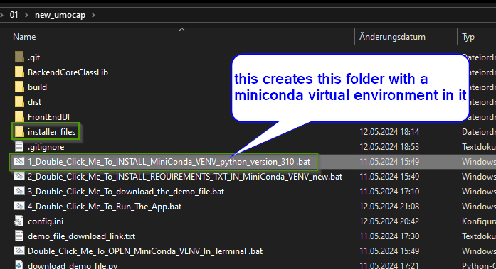
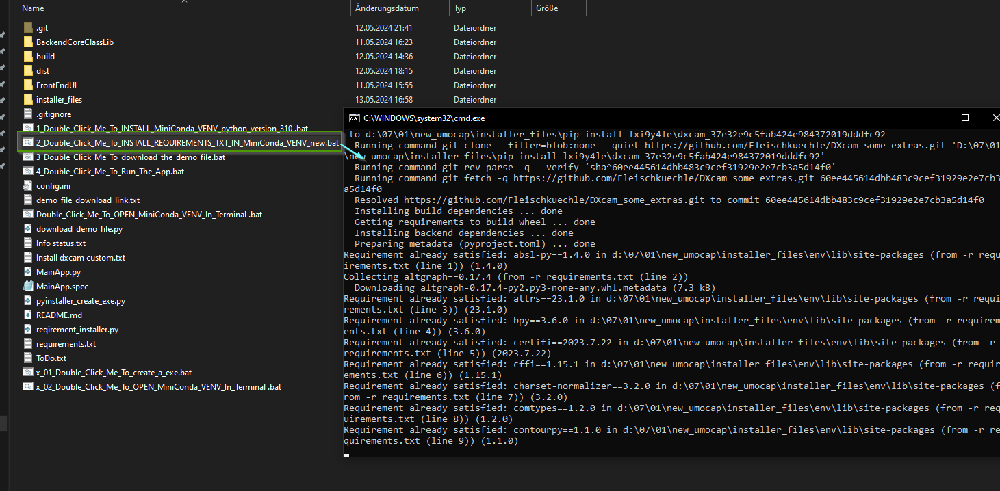
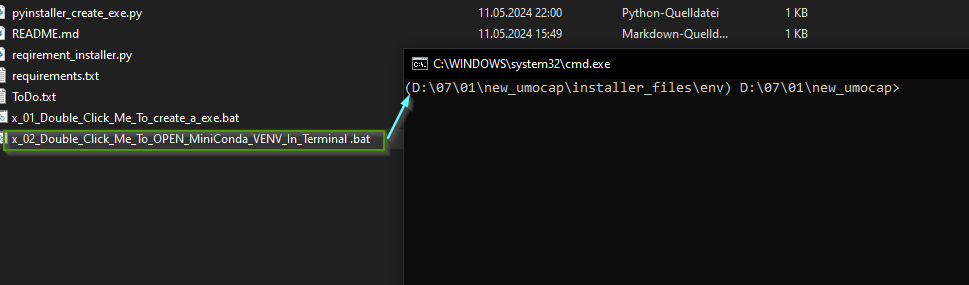
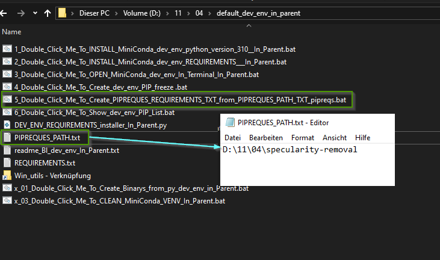
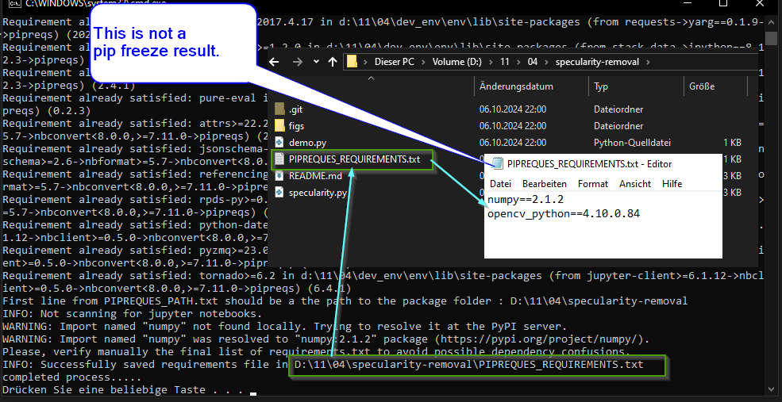
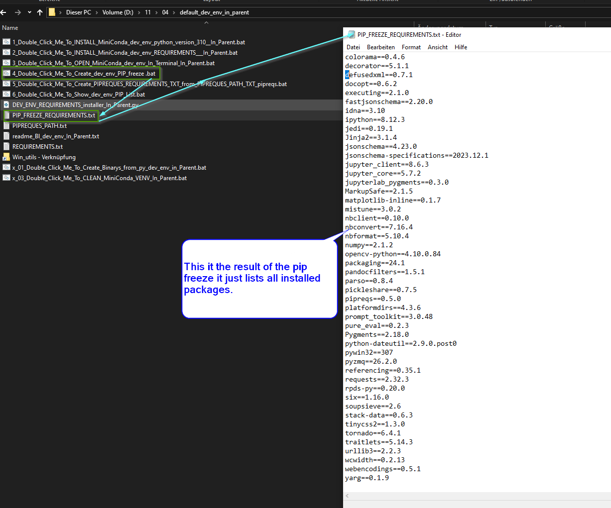

# standalone_env_in_parent_python_310
This are windows batch scripts that install a standalone (portable) python 310 virtual environment using  miniconda

ATTENTIONE ---------Checksum Verivication need to be updated.--------------!!!!!!!!!!!!!

The checksum is a hash function that checks if miniconda is comming from the right source
if you get a message on installation of miniconda that says
Checksum does not match you need to  go to the developers page to get the correct checksum
and add it to the bat file. 
(ill try to keep it uptodate right now its 26.02.2025)
this is the hash
2025-02-11 15:04:49	fb936987b769759fc852af1b2a0e359ac14620c2b7bea8a90c6d920f2b754c4a
on this url
https://repo.anaconda.com/miniconda/Miniconda3-latest-Windows-x86_64.exe

added two miniconda installer:
one for miniconda latest:
1_1_Double_Click_Me_To_INSTALL_MiniConda_dev_env_python_version_Latest__In_Parent .bat
one for miniconda python 310
1_0_Double_Click_Me_To_INSTALL_MiniConda_dev_env_python_version_310__In_Parent.bat

for cloning

git clone https://github.com/Fleischkuechle/standalone_env_in_parent_python_310.git

1_Double_Click_Me_To_INSTALL_MiniConda_VENV_python_version_310 .bat
here you can find diffrent version of miniconda: https://repo.anaconda.com/miniconda/
in this bat script this one is used:
set MINICONDA_DOWNLOAD_URL=https://repo.anaconda.com/miniconda/Miniconda3-latest-Windows-x86_64.exe
to install others just replace this link.
This installs a miniconda in the folder where its placed in and the doubleclick on it

2_Double_Click_Me_To_INSTALL_REQUIREMENTS_TXT_IN_MiniConda_VENV_new.bat

This installs all requirements in the with 1_Double_Click_Me_To_INSTALL_MiniConda_VENV_python_version_310 .bat
installed virtual environment  (there must be a text file with the requiremnts.txt in the same folder)

x_02_Double_Click_Me_To_OPEN_MiniConda_VENV_In_Terminal .bat

this opens the previous installed virtual environment in a terminal

TO get the requirements.txt that only shows the requirements of your project 
you can use 5_Double_Click_Me_To_Create_PIPREQUES_REQUIREMENTS_TXT_from_PIPREQUES_PATH_TXT_pipreqs.bat

this looks into this file where you put the path to your project in it
something like: D:\02\05\36\my_project_folder\
PIPREQUES_PATH.txt 

what is does:
it creates a text file called: PIPREQUES_REQUIREMENTS.txt
inside you project path from PIPREQUES_PATH.txt 
in this example you will find the file here:
D:\02\05\36\my_project_folder\PIPREQUES_REQUIREMENTS.txt

Here is an example:

A terminal window (we are on windows) will open and show this:

To understand: This is not a pip freeze result this only shows the dependencies you have in the 
project.

For comarision here is a pip freeze (created with 4_Double_Click_Me_To_Create_dev_env_PIP_freeze .bat):

